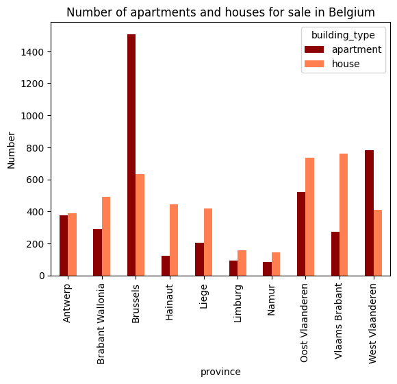
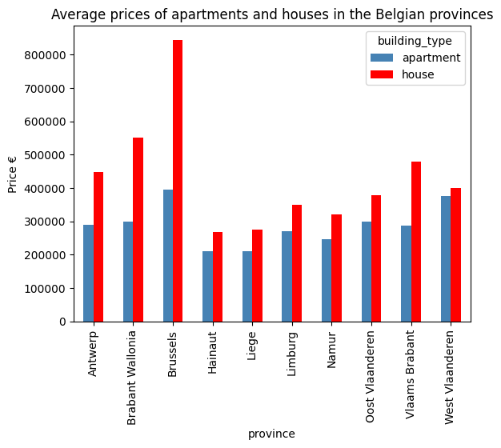
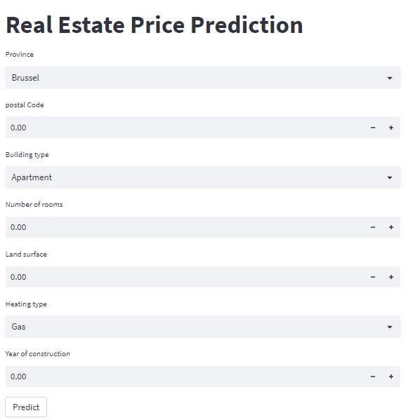

# Real-Estate-Price-Prediction

**Real estate price prediction** is a complex task, but it can be made more accurate through the use of machine learning algorithms. Our project aims to gather data from [immoweb](https://www.immoweb.be/en), a popular real estate platform in Belgium, and create a dataset consisting of information on thousands of properties. This data will then be used to train a machine learning model that can predict property prices with greater accuracy than traditional methods. By utilizing immoweb's comprehensive database, we hope to create a reliable and robust dataset that can improve the accuracy of real estate price predictions in Belgium.

# Prerequisites

To run the program successfully, it is important to have compatible and up-to-date software requirements:

- [Python 3.10](https://www.python.org/downloads/)
- [Selenium](https://www.selenium.dev/)
- [ChromeDriver](https://chromedriver.chromium.org/downloads)
- [BeautifulSoup](https://beautiful-soup-4.readthedocs.io/en/latest/)
- [pandas](https://pandas.pydata.org/)
- [NumPy](https://numpy.org/)
- [Matplotlib](https://matplotlib.org/)
- [scikit-learn](https://scikit-learn.org/stable/)
- [Joblib](https://joblib.readthedocs.io/en/latest/)
- [Streamlit](https://streamlit.io/)

# Steps I follow

 **Data Acquisition**
 Use Selenium to extract data from [immoweb](https://www.immoweb.be/en), Belgian real estate website, and create a dataset in CSV format. This dataset will contain information of thousands properties in Belgium, allowing for detailed analysis and insights on the real estate market.

**Data Analysis**
Use pandas library to clean the dataset from empty values ​​and incomplete information and then use matplotlib library to  make a visualization of data and design clear charts to present data information.

## visualization of data

**Model Training**
After I analyze the Belgian Real Estate market , I develop a Machine Learning model using "scikit-learn" to predict property prices in Belgium.

**Deployment**
I use the "joblib" library to save the trained model and loaded it for testing purposes. To enhance user experience, I utilized "streamlit" to create a user-friendly interface for non-developers to efficiently use the model locally.

## User Interface

# Usage
After you clone Real-Estate-Price-Prediction repository locally , you could go to deployment folder and  run this command in your terminal

    streamlit run app.py

Then the User Interface will open in your browser and you can use it easily.

# Project Team
All steps of this project have been done by :
- [AbdulHamid Albaz](https://www.linkedin.com/in/abdulhamid-albaz/)